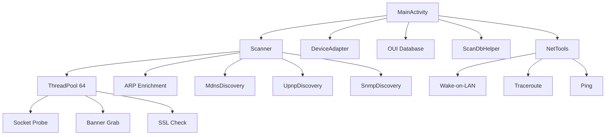
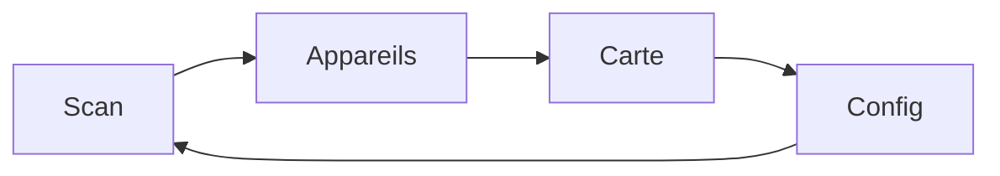
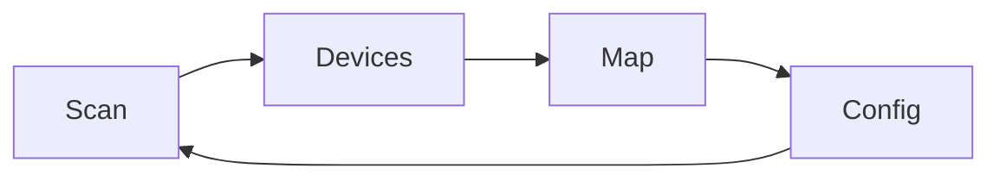
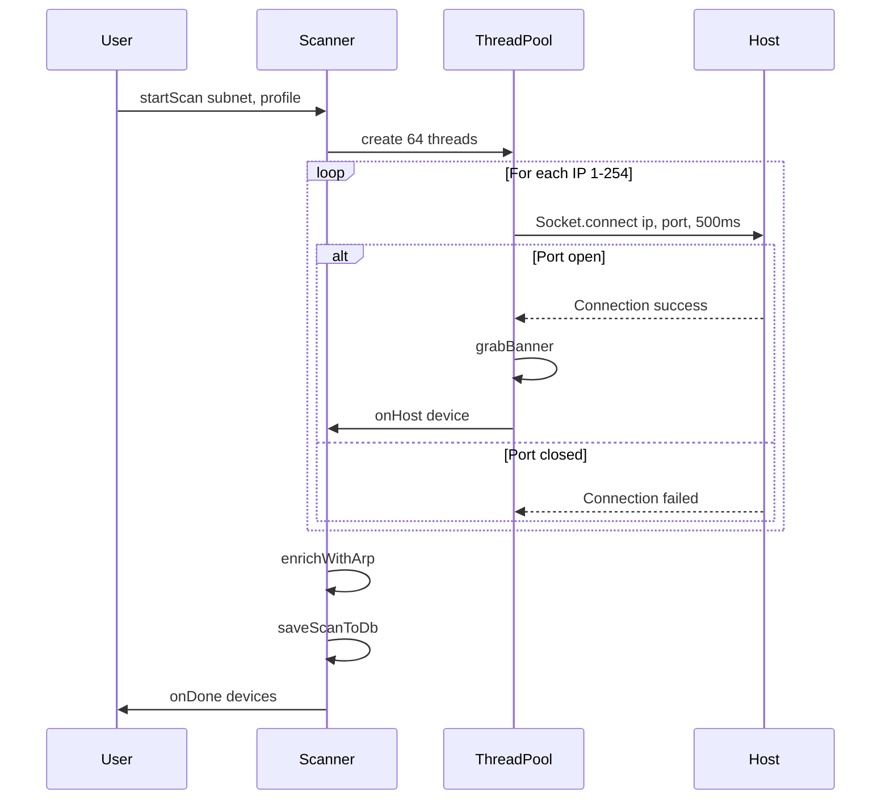
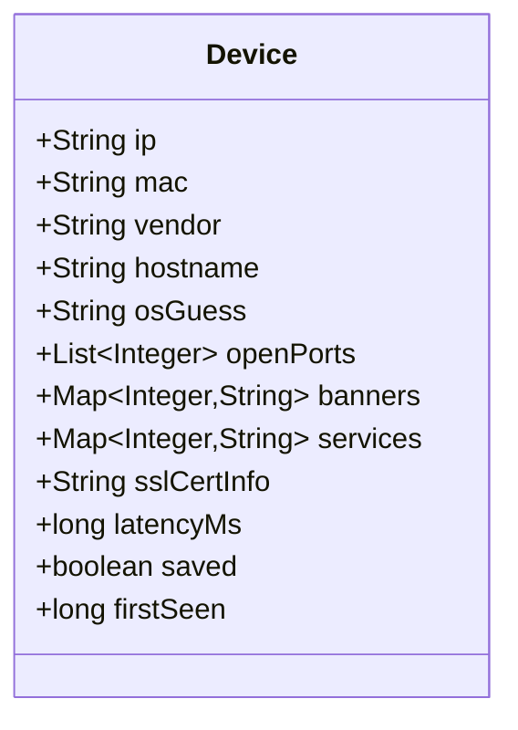
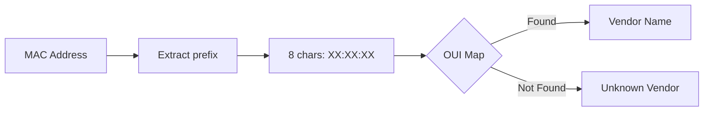

# NetMapper

> Scanner réseau Android inspiré de nmap | Android network scanner inspired by nmap

[](https://developer.android.com)
[](https://openjdk.org/)
[](LICENSE)

---

## Table des matières / Table of Contents

- [FR - Français](#fr---français)
- [EN - English](#en---english)
- [Documentation technique / Technical Documentation](docs/PROTOCOLS.md)

---

## FR - Français

### Description

NetMapper est une application Android native de scan réseau qui permet de découvrir les appareils connectés sur votre réseau local. Elle offre des fonctionnalités similaires à nmap avec une interface mobile intuitive.

### Fonctionnalités

- **Scan réseau** : Découverte d'hôtes sur le réseau local (plage /24)
- **3 profils de scan** :
  - Ping : ICMP/ARP uniquement (rapide)
  - Quick : 6 ports courants (22, 80, 443, 8080, 3389, 445)
  - Full : 23 ports (scan complet)
- **Détection Wi-Fi** : Récupération automatique du SSID, BSSID, IP locale et gateway
- **Base OUI** : 60+ fabricants reconnus (Apple, Samsung, Raspberry Pi, etc.)
- **Carte topologique** : Visualisation textuelle de la topologie réseau
- **Enrichissement ARP** : Récupération des adresses MAC
- **Banner grabbing** : Récupération des bannières HTTP, SSH, FTP, SMTP
- **OS fingerprinting** : Détection du système d'exploitation
- **Certificats SSL** : Affichage des infos SSL/TLS
- **Mesure de latence** : RTT en millisecondes
- **Wake-on-LAN** : Réveil d'appareils via magic packet
- **Traceroute** : Affichage du chemin réseau
- **Ping** : Test de connectivité avec statistiques
- **mDNS/Bonjour** : Découverte de services (Apple, Chromecast, Spotify, etc.)
- **UPnP/SSDP** : Détection d'appareils UPnP (box, TV, NAS, etc.)
- **SNMP** : Interrogation des équipements réseau (routeurs, switches)
- **Notes** : Ajout de notes personnalisées sur les appareils
- **Export** : JSON et CSV
- **Historique** : Base SQLite des scans

### Architecture



### Interface



| Onglet    | Description                          |
| --------- | ------------------------------------ |
| Scan      | Configuration et lancement du scan   |
| Appareils | Liste filtrable des hôtes découverts |
| Carte     | Topologie réseau visuelle            |
| Config    | Outils réseau, export, statistiques  |

### Outils réseau

| Outil       | Description                           |
| ----------- | ------------------------------------- |
| MAC Lookup  | Recherche fabricant par OUI           |
| Ping        | Test connectivité (4 paquets)         |
| Traceroute  | Chemin réseau (max 15 hops)           |
| Wake-on-LAN | Réveil via magic packet UDP:9         |
| mDNS Scan   | Découverte services Bonjour (port 5353)|
| UPnP Scan   | Découverte SSDP (port 1900)           |
| SNMP Scan   | Requêtes SNMP v1 (port 161)           |
| Export JSON | Export complet au format JSON         |
| Export CSV  | Export tableur au format CSV          |

### Permissions requises

| Permission           | Raison                     |
| -------------------- | -------------------------- |
| INTERNET             | Connexion socket aux hôtes |
| ACCESS_WIFI_STATE    | Lecture infos WiFi         |
| ACCESS_NETWORK_STATE | État réseau                |
| ACCESS_FINE_LOCATION | Scan WiFi (Android 6+)     |
| NEARBY_WIFI_DEVICES  | Scan WiFi (Android 13+)    |

### Installation

1. Télécharger `NetMapper-v1.0.apk`
2. Activer "Sources inconnues" dans les paramètres
3. Installer l'application

### Compilation

```bash
# Cloner le projet
git clone https://github.com/venantvr/Android.Net.Mapper.git
cd Android.Net.Mapper

# Compiler en debug
./gradlew assembleDebug

# Compiler en release
./gradlew assembleRelease

# Signer l'APK
apksigner sign --ks release-key.jks --out app-signed.apk app-release-unsigned.apk
```

---

## EN - English

### Description

NetMapper is a native Android network scanner app that discovers devices connected to your local network. It provides nmap-like functionality with an intuitive mobile interface.

### Features

- **Network scan**: Host discovery on local network (/24 range)
- **3 scan profiles**:
  - Ping: ICMP/ARP only (fast)
  - Quick: 6 common ports (22, 80, 443, 8080, 3389, 445)
  - Full: 23 ports (complete scan)
- **Wi-Fi detection**: Automatic SSID, BSSID, local IP and gateway retrieval
- **OUI database**: 60+ recognized manufacturers (Apple, Samsung, Raspberry Pi, etc.)
- **Topology map**: Text-based network topology visualization
- **ARP enrichment**: MAC address retrieval
- **Banner grabbing**: HTTP, SSH, FTP, SMTP banner capture
- **OS fingerprinting**: Operating system detection
- **SSL certificates**: SSL/TLS certificate info
- **Latency measurement**: RTT in milliseconds
- **Wake-on-LAN**: Device wake via magic packet
- **Traceroute**: Network path display
- **Ping**: Connectivity test with statistics
- **mDNS/Bonjour**: Service discovery (Apple, Chromecast, Spotify, etc.)
- **UPnP/SSDP**: UPnP device detection (routers, TVs, NAS, etc.)
- **SNMP**: Network equipment interrogation (routers, switches)
- **Notes**: Add custom notes on devices
- **Export**: JSON and CSV
- **History**: SQLite scan database

### Architecture


### Interface



| Tab     | Description                         |
| ------- | ----------------------------------- |
| Scan    | Scan configuration and launch       |
| Devices | Filterable list of discovered hosts |
| Map     | Visual network topology             |
| Config  | Network tools, export, statistics   |

### Network Tools

| Tool        | Description                           |
| ----------- | ------------------------------------- |
| MAC Lookup  | Vendor lookup by OUI                  |
| Ping        | Connectivity test (4 packets)         |
| Traceroute  | Network path (max 15 hops)            |
| Wake-on-LAN | Wake via magic packet UDP:9           |
| mDNS Scan   | Bonjour service discovery (port 5353) |
| UPnP Scan   | SSDP discovery (port 1900)            |
| SNMP Scan   | SNMP v1 queries (port 161)            |
| Export JSON | Full export in JSON format            |
| Export CSV  | Spreadsheet export in CSV             |

### Required Permissions

| Permission           | Reason                     |
| -------------------- | -------------------------- |
| INTERNET             | Socket connection to hosts |
| ACCESS_WIFI_STATE    | WiFi info reading          |
| ACCESS_NETWORK_STATE | Network state              |
| ACCESS_FINE_LOCATION | WiFi scan (Android 6+)     |
| NEARBY_WIFI_DEVICES  | WiFi scan (Android 13+)    |

### Installation

1. Download `NetMapper-v1.0.apk`
2. Enable "Unknown sources" in settings
3. Install the application

### Build

```bash
# Clone the project
git clone https://github.com/venantvr/Android.Net.Mapper.git
cd Android.Net.Mapper

# Debug build
./gradlew assembleDebug

# Release build
./gradlew assembleRelease

# Sign APK
apksigner sign --ks release-key.jks --out app-signed.apk app-release-unsigned.apk
```

---

## Technical Details

### Scanner Algorithm



### Device Model



### OUI Lookup



---

## Screenshots

Dark Material3 theme with:
- Background: `#080F18`
- Surface: `#0D1B2A`
- Primary: `#0A84FF`
- Success: `#4CAF50`

---

## License

MIT License

## Author

Generated with Claude Code
