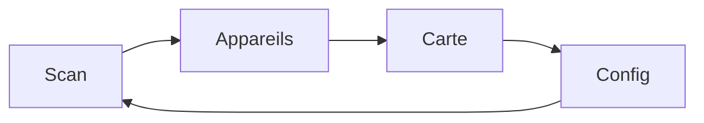
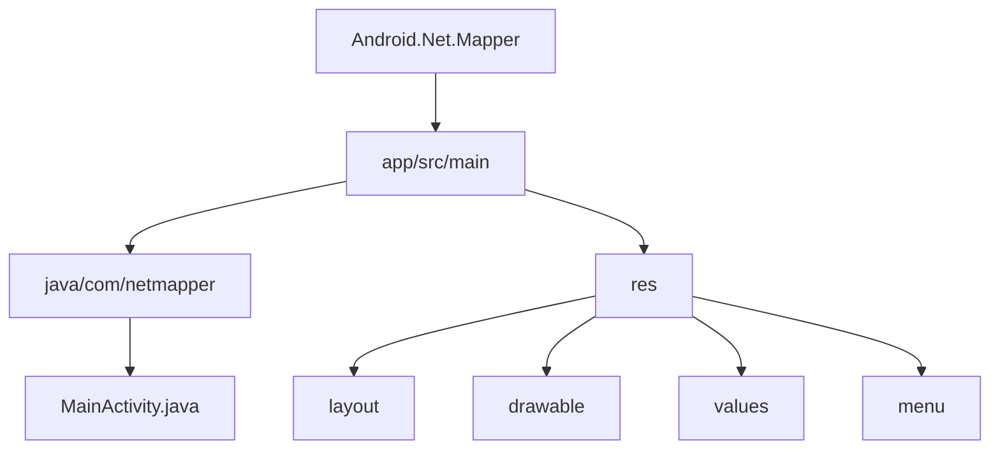
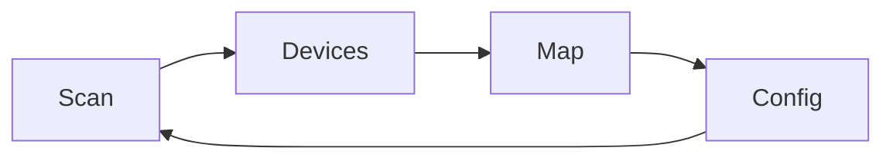
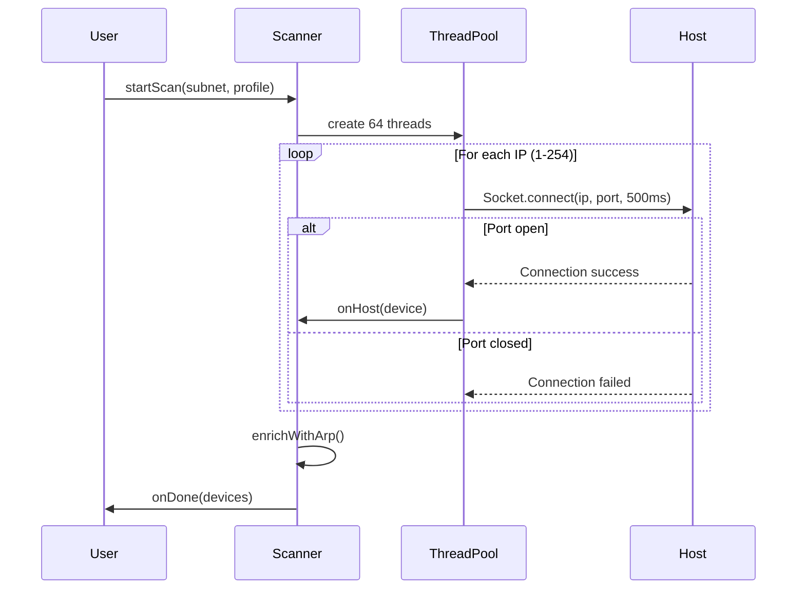
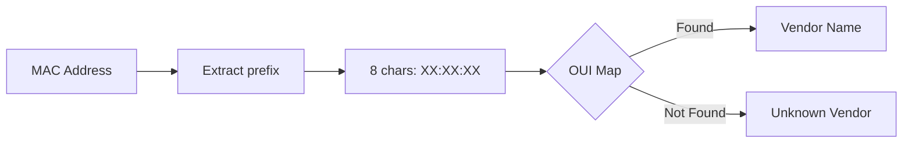

# NetMapper

> Scanner réseau Android inspiré de nmap | Android network scanner inspired by nmap

---

## Table des matières / Table of Contents

- [FR - Français](#fr---français)
- [EN - English](#en---english)

---

## FR - Français

### Description

NetMapper est une application Android native de scan réseau qui permet de découvrir les appareils connectés sur votre réseau local. Elle offre des fonctionnalités similaires à nmap avec une interface mobile intuitive.

### Fonctionnalités

- **Scan réseau** : Découverte d'hôtes sur le réseau local (plage /24)
- **3 profils de scan** :
  - Ping : ICMP/ARP uniquement (rapide)
  - Quick : 6 ports courants (22, 80, 443, 8080, 3389, 445)
  - Full : 18 ports (scan complet)
- **Détection Wi-Fi** : Récupération automatique du SSID, BSSID, IP locale et gateway
- **Base OUI** : 60+ fabricants reconnus (Apple, Samsung, Raspberry Pi, etc.)
- **Carte topologique** : Visualisation textuelle de la topologie réseau
- **Enrichissement ARP** : Récupération des adresses MAC via /proc/net/arp
- **Support nmap natif** : Possibilité d'utiliser un binaire nmap ARM64

### Architecture

```mermaid
graph TD
    A[MainActivity] --> B[Scanner]
    A --> C[DeviceAdapter]
    A --> D[OUI Database]
    B --> E[ThreadPool 64]
    E --> F[Socket Probe]
    E --> G[ICMP/ARP Check]
    B --> H[ARP Enrichment]
    H --> I[/proc/net/arp]
```

### Interface



| Onglet    | Description                          |
| --------- | ------------------------------------ |
| Scan      | Configuration et lancement du scan   |
| Appareils | Liste filtrable des hôtes découverts |
| Carte     | Topologie réseau visuelle            |
| Config    | Lookup MAC, statistiques, docs nmap  |

### Permissions requises

| Permission           | Raison                     |
| -------------------- | -------------------------- |
| INTERNET             | Connexion socket aux hôtes |
| ACCESS_WIFI_STATE    | Lecture infos WiFi         |
| ACCESS_NETWORK_STATE | État réseau                |
| ACCESS_FINE_LOCATION | Scan WiFi (Android 6+)     |
| NEARBY_WIFI_DEVICES  | Scan WiFi (Android 13+)    |

### Installation

1. Télécharger l'APK signé
2. Activer "Sources inconnues" dans les paramètres
3. Installer l'application

### Compilation

```bash
# Cloner le projet
git clone <repository>
cd Android.Net.Mapper

# Compiler en debug
./gradlew assembleDebug

# Compiler en release
./gradlew assembleRelease

# Signer l'APK
apksigner sign --ks release-key.jks --out app-signed.apk app-release-unsigned.apk
```

### Structure du projet



---

## EN - English

### Description

NetMapper is a native Android network scanner app that discovers devices connected to your local network. It provides nmap-like functionality with an intuitive mobile interface.

### Features

- **Network scan**: Host discovery on local network (/24 range)
- **3 scan profiles**:
  - Ping: ICMP/ARP only (fast)
  - Quick: 6 common ports (22, 80, 443, 8080, 3389, 445)
  - Full: 18 ports (complete scan)
- **Wi-Fi detection**: Automatic SSID, BSSID, local IP and gateway retrieval
- **OUI database**: 60+ recognized manufacturers (Apple, Samsung, Raspberry Pi, etc.)
- **Topology map**: Text-based network topology visualization
- **ARP enrichment**: MAC address retrieval via /proc/net/arp
- **Native nmap support**: Optional ARM64 nmap binary support

### Architecture

```mermaid
graph TD
    A[MainActivity] --> B[Scanner]
    A --> C[DeviceAdapter]
    A --> D[OUI Database]
    B --> E[ThreadPool 64]
    E --> F[Socket Probe]
    E --> G[ICMP/ARP Check]
    B --> H[ARP Enrichment]
    H --> I[/proc/net/arp]
```

### Interface



| Tab     | Description                         |
| ------- | ----------------------------------- |
| Scan    | Scan configuration and launch       |
| Devices | Filterable list of discovered hosts |
| Map     | Visual network topology             |
| Config  | MAC lookup, stats, nmap docs        |

### Required Permissions

| Permission           | Reason                     |
| -------------------- | -------------------------- |
| INTERNET             | Socket connection to hosts |
| ACCESS_WIFI_STATE    | WiFi info reading          |
| ACCESS_NETWORK_STATE | Network state              |
| ACCESS_FINE_LOCATION | WiFi scan (Android 6+)     |
| NEARBY_WIFI_DEVICES  | WiFi scan (Android 13+)    |

### Installation

1. Download the signed APK
2. Enable "Unknown sources" in settings
3. Install the application

### Build

```bash
# Clone the project
git clone <repository>
cd Android.Net.Mapper

# Debug build
./gradlew assembleDebug

# Release build
./gradlew assembleRelease

# Sign APK
apksigner sign --ks release-key.jks --out app-signed.apk app-release-unsigned.apk
```

### Project Structure


---

## Technical Details

### Scanner Algorithm



### OUI Lookup



---

## License

MIT License

## Author

Generated with Claude Code
